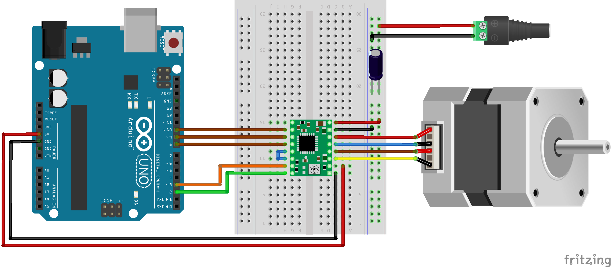

# Motor and Camera Controller

This project provides a Python-based controller for a stepper motor and a Thorlabs camera. The motor is controlled via an Arduino, allowing for precise control over parameters such as microstepping, speed, and acceleration. The camera controller provides a live view and image capture functionality using a graphical user interface (GUI) built with Tkinter.
Table of Contents

    Features
        Hardware Requirements
        Software Requirements
    Installation
    Configuration
    Usage
        Motor Controller
        Camera Controller
    Project Structure
    License
    Acknowledgements

## Features
```
Motor Control:
    Control a stepper motor via an Arduino.
    Upload Arduino sketches directly from Python.
    Adjust motor parameters such as steps per revolution, microstepping, speed, and acceleration.
    Rotate the motor forwards and backwards by a specified number of steps or revolutions.
    Progress bar to visualize motor rotation progress.

Camera Control:
    Live view of the camera feed using Tkinter GUI.
    Capture and save images from the camera.
    Threaded image acquisition to ensure smooth GUI performance.
```
### Hardware Requirements
```
Arduino Uno (or compatible board)
Stepper Motor
Stepper Motor Driver (e.g., A4988, DRV8825)
Thorlabs Camera (compatible with Thorlabs TSI SDK)
Connecting Cables and Power Supply
```
Circuit Diagram



### Software Requirements
```
Python 3.x
Arduino CLI (must be installed and added to system PATH)
Thorlabs TSI SDK (must be installed for camera control)
Required Python Packages:
    pyserial
    configparser
    tqdm
    tkinter (usually included with Python)
    Pillow
    numpy
    thorlabs_tsi_sdk
```
## Installation

### 1. Clone the Repository

Start by cloning the repository and navigating into the project directory:
```
git clone https://github.com/drichter-official/experimental_setup_control.git
cd experimental_setup_control
```
### 2. Set Up Python Environment and Install Dependencies

It's recommended to use a virtual environment to manage dependencies.

1. **Create a virtual environment** (optional but recommended):
```
python -m venv venv
source venv/bin/activate 
```
2. **Install required packages**:
```
pip install -r requirements.txt
```
3. **Install the Thorlabs camera library**:
```
pip install thorlabs_tsi_camera_python_sdk_package.zip
```
### 3. Install Arduino CLI

You’ll need the Arduino CLI to program the Arduino. Follow these steps:

1. **Download and extract Arduino CLI**:
```
wget https://downloads.arduino.cc/arduino-cli/arduino-cli_latest_Linux_64bit.tar.gz
tar -xvf arduino-cli_latest_Linux_64bit.tar.gz
```
2. **Move `arduino-cli` to a directory in your PATH**:
```
sudo mv arduino-cli /usr/local/bin/
```
3. **Configure Arduino CLI and install required libraries**:
```
arduino-cli config init
arduino-cli core update-index
arduino-cli core install arduino:avr
arduino-cli lib install AccelStepper
```
### 4. Install Thorlabs TSI SDK

To interact with Thorlabs cameras, install the Thorlabs TSI SDK.

1. **Download and extract the Thorlabs TSI SDK**:
```
wget https://www.thorlabs.com/software/THO/ThorCam/Programming/Scientific_Camera_Interfaces_Linux-2.0.zip
unzip Scientific_Camera_Interfaces_Linux-2.0.zip
cd Scientific_Camera_Interfaces
```
2. **Copy necessary files to the appropriate directories**:
```
sudo cp SDK/Native_Toolkit/bin/Native_64_lib/*.so /usr/local/lib
sudo ldconfig -v
sudo cp usb.rules /etc/udev/rules.d
```
3. **Set USB permissions** (if required):

If you encounter permission issues with USB access, add your user to the `dialout` group:
```
sudo usermod -a -G dialout $USER
```
After running this command, log out and back in, then verify you’re in the `dialout` group:
```
groups $USER
```

## Configuration
### Motor Configuration

Edit the configs/config.ini file to set your motor parameters:
```
[DEFAULT]
# Motor parameters:
revolutions = 10
steps_per_revolution_base = 200
micro_stepping = 16
motor_acceleration = 100
motor_max_speed = 100
set_motor_speed = 100
```
Explantations: 
```
revolutions: Number of revolutions to rotate.
steps_per_revolution_base: Number of steps for one full motor revolution at full step.
micro_stepping: Microstepping level (1, 2, 4, 8, or 16).
motor_acceleration: Motor acceleration in steps per second squared.
motor_max_speed: Maximum motor speed in steps per second.
set_motor_speed: Desired motor speed in steps per second.
```
## Usage
### Motor Controller
1. Prepare the Arduino Sketch

Ensure that your Arduino sketch is set up to receive commands from the Python script. The sketch should use macros for configuration parameters, which will be set during the upload process.

2. Run the Motor Controller Script

```
python main.py --load_config --sketch_path path/to/your/sketch.ino
```
    --load_config: Loads configuration from the config.ini file.
    --sketch_path: Path to the Arduino sketch (if not specified in the config file).

3. Command-Line Arguments

You can also override configurations using command-line arguments:

```
python main.py --revolutions 5 --micro_stepping 8 --motor_max_speed 200 --sketch_path path/to/your/sketch.ino
```

4. Example Workflow

The script uploads the Arduino sketch to the connected Arduino board.
Configuration parameters are passed during compilation.
After uploading, the script establishes a serial connection with the Arduino.
The motor rotates according to the specified parameters.
A progress bar displays the rotation progress.

### Camera Controller
1. Start the Camera Live View

```
python camera_controller.py
```

2. Features

    Live View: Displays the live feed from the camera.
    Take Picture: Click the "Take Picture" button to capture and save an image.
    Image Saving: Images are saved with a timestamped filename in the current directory.

3. GUI Controls

    Live View Canvas: Displays the camera feed.
    Take Picture Button: Captures and saves the current frame.

## Project Structure

```
motor_camera_controller/
├── configs/
│   └── config.ini
├── main.py
├── camera_controller.py
├── utils_motor/
│   ├── __init__.py
│   ├── motor_controller.py
│   └── utils.py
├── utils_camera/
│   ├── __init__.py
│   └── [camera utility files]
├── requirements.txt
└── README.md
```

    configs/: Configuration files.
    main.py: Entry point for the motor controller script.
    camera_controller.py: Script for controlling the camera.
    utils_motor/: Contains motor control classes and utility functions.
    utils_camera/: Contains camera control classes and utility functions.
    requirements.txt: List of Python dependencies.
    README.md: Project documentation.

Note: Ensure all hardware connections are correct before running the scripts to prevent damage to the equipment. Always test with caution.
